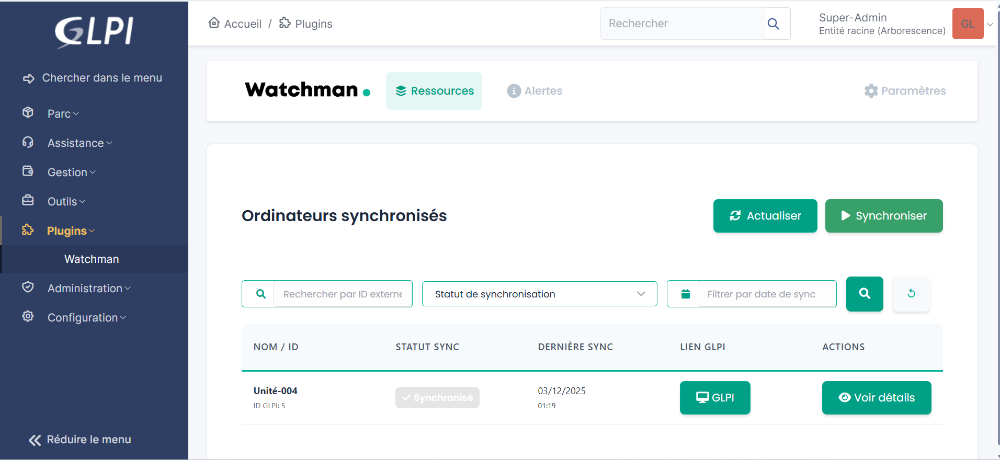
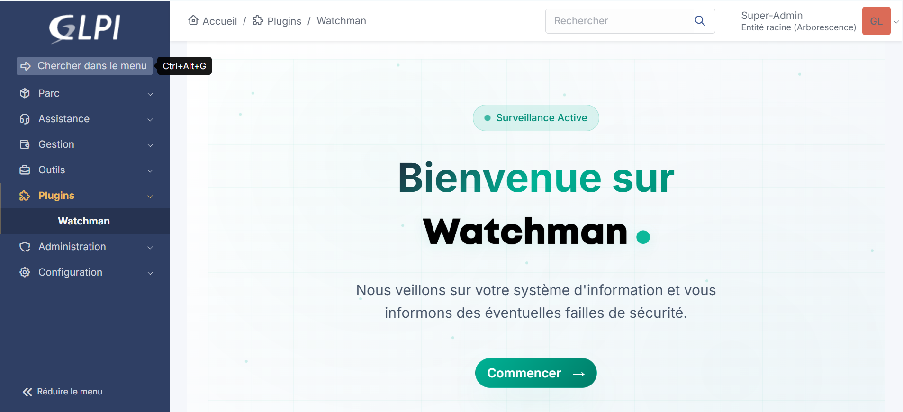

# Watchman - CVE Monitoring Plugin for GLPI


**Watchman** is a comprehensive security plugin that integrates CVE (Common Vulnerabilities and Exposures) monitoring into GLPI. It provides automated vulnerability detection, tracking, and management capabilities for your IT assets.

## Features

### Core Capabilities

- **Automated CVE Monitoring**: Continuous synchronization with external vulnerability databases
- **Alert Management**: Create and manage security alerts with customizable severity levels (Critical, High, Medium, Low)
- **Ticket Integration**: Automatic ticket creation for detected vulnerabilities in GLPI
- **Patch Tracking**: Monitor remediation status and patch deployment progress
- **Computer Integration**: Enhanced Computer objects with real-time security data
- **Dashboard & Reporting**: Comprehensive views of your security posture
- **API Integration**: Connect to external vulnerability intelligence sources
- **Cron Automation**: Scheduled synchronization and automated workflows

### Management Features

- CVE database synchronization
- Alert lifecycle management
- Computer vulnerability mapping
- Configuration management for API credentials
- Comprehensive error logging
- Multi-language support (English, French)

## Requirements

- GLPI >= 10.0.0
- PHP >= 7.4
- Composer for dependency management

## Installation

1. Download the latest release from the [releases page](https://github.com/bienvenu-gits/watchman-glpi/releases)
2. Extract the archive to your GLPI plugins directory:
   ```bash
   cd /path/to/glpi/plugins
   unzip watchman-x.x.x.zip
   ```
3. Install dependencies:
   ```bash
   cd watchman
   composer install --no-dev
   ```
4. Log in to GLPI and navigate to Setup > Plugins
5. Install and activate the Watchman plugin
6. Configure your API credentials in the plugin configuration page

## Configuration

After installation, configure Watchman through:

1. Navigate to **Plugins > Watchman**
2. Click on **Configuration**
3. Enter your vulnerability database API credentials
4. Configure synchronization schedules
5. Set up automatic ticket creation rules

## Usage

### Alert Management

Access alert management through **Plugins > Watchman > Alert Manager** to:
- View all CVE alerts
- Filter by severity, status, or date
- Create manual alerts
- Link alerts to tickets
- Track remediation progress

### Computer CVE Tracking

Enhanced Computer objects now display:
- Associated CVE vulnerabilities
- Risk assessment
- Patch status
- Historical vulnerability data

### Automated Synchronization

Watchman uses GLPI's cron system for:
- Regular CVE database updates
- Computer vulnerability scanning
- Alert generation
- Status synchronization

## Screenshots




## Development

### Project Structure

```
watchman/
├── src/              # Core PHP classes
├── front/            # Frontend pages
├── locales/          # Translations
├── assets/           # Images and resources
├── setup.php         # Plugin configuration
├── hook.php          # Installation/uninstall hooks
└── watchman.xml      # Marketplace metadata
```

### Contributing

We welcome contributions! Please follow these guidelines:

1. Open a ticket for each bug/feature so it can be discussed
2. Follow [GLPI development guidelines](http://glpi-developer-documentation.readthedocs.io/en/latest/plugins/index.html)
3. Refer to [GitFlow](http://git-flow.readthedocs.io/) process for branching
4. Work on a new branch on your own fork
5. Open a PR that will be reviewed by a developer

### Development Setup

```bash
git clone https://github.com/bienvenu-gits/watchman-glpi.git
cd watchman
composer install
```

## License

This plugin is licensed under the MIT License. See [LICENSE](LICENSE) file for details.

## Support

- **Issues**: [GitHub Issues](https://github.com/bienvenu-gits/watchman-glpi/issues)
- **Documentation**: [GitHub Wiki](https://github.com/bienvenu-gits/watchman-glpi/wiki)

## Authors

- **Global IT Service** - [http://www.gits.bj](http://www.gits.bj)

## Changelog

### Version 0.0.1 (Initial Release)
- Initial plugin structure
- CVE monitoring integration
- Alert management system
- Computer vulnerability tracking
- Automated synchronization
- Multi-language support (EN, FR)
